# Note Status for Obsidian

[](https://github.com/devonthesofa/obsidian-note-status/releases) [](https://obsidian.md/plugins?id=note-status) [](https://github.com/devonthesofa/obsidian-note-status/blob/master/LICENSE)

Enhance your Obsidian workflow with a powerful status tracking system for your notes. Keep track of whether your notes are active, on hold, completed, or dropped - or create your own custom statuses.

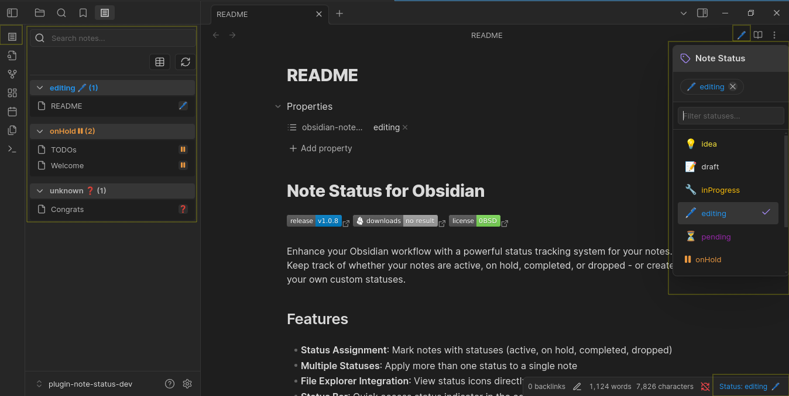

## Table of Contents

- [Features](#features)
- [Installation](#installation)
- [User Guide](#user-guide)
- [Configuration](#configuration)
- [Performance Recommendations](#performance-recommendations)
- [Development](#development)
- [Roadmap](#roadmap)
- [Support](#support-the-development)

## Features

- **Status Assignment**: Mark notes with statuses (active, on hold, completed, dropped)
- **Multiple Statuses**: Apply more than one status to a single note
- **File Explorer Integration**: View status icons directly in your file explorer
- **Status Bar**: Quick access status indicator in the editor
- **Dropdown Menu**: Easily change status from the editor toolbar
- **Status Pane**: Dedicated view that organizes notes by status
- **Batch Updates**: Apply statuses to multiple files at once
- **Custom Statuses**: Create your own statuses with icons and colors
- **Status Templates**: Choose from predefined templates or create your own
- **Highly Customizable**: Configure where and how statuses appear
- **Large Vault Support**: Optimized for performance with pagination and filtering options

## Installation

### Marketplace Installation (Recommended)

1. Open Obsidian → Settings → Community plugins
2. Disable Safe mode
3. Click "Browse" and search for "Note Status"
4. Click Install and Enable

### Manual Installation

1. **Download the Plugin**:
    - Grab the latest release from the [GitHub Releases page](https://github.com/devonthesofa/obsidian-note-status/releases).
    - Download the files `main.js`, `styles.css` and `manifest.json`
2. **Install in Obsidian**:
    - Open your Obsidian vault and navigate to `.obsidian/plugins/`.
    - Create a folder named `obsidian-note-status` into this directory.
    - Copy the downloaded files in the `obsidian-note-status` folder.
3. **Enable the Plugin**:
    - In Obsidian, go to Settings > Community Plugins.
    - Ensure "Safe Mode" is turned off.
    - Find "Note Status" in the list and toggle it on.

## User Guide

### Basic Usage

#### 1. Assign Status from the Toolbar

The simplest way to set a note's status is using the toolbar button:


1. Open any note
2. Click the status icon in the toolbar (looks like a "?" by default)
3. Select a status from the dropdown
4. The status will be applied and visible in both toolbar and status bar

#### 2. Status Bar

The status bar at the bottom of your editor shows the current status of your note:

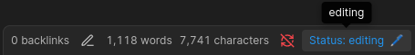

- When multiple statuses are enabled, all applied statuses will be displayed here

#### 3. Status Pane

The Status Pane provides an overview of all your notes grouped by status:

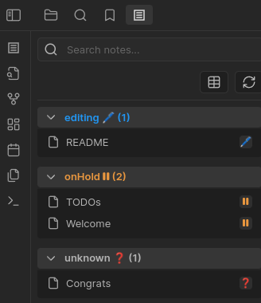

To open the Status Pane:

- Click the status pane icon in the left sidebar
- Use the command palette: "Open status pane"
  In the Status Pane you can:
- View all notes grouped by status
- Click on any note to open it
- Search for specific notes
- Toggle between compact and standard views
- Right-click on notes for more options

#### 4. File Explorer Integration

Status icons appear directly in your file explorer:

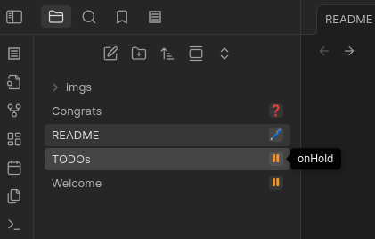

- Right-click on any file to change its status
- Select multiple files to batch update their statuses

### Advanced Usage

#### Multiple Statuses

When enabled in settings, you can assign multiple statuses to a single note:

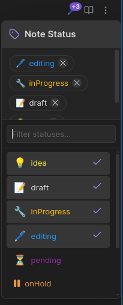

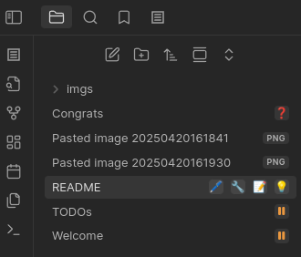


To add additional statuses:

1. Open the status dropdown
2. Click on another status to add it
3. Click on an active status to remove it

#### Batch Updates

To update multiple files at once:

1. Select multiple files in the file explorer (using Ctrl/Cmd or Shift)
2. Right-click and choose "Change status"
3. Select whether to replace or add the status
4. Choose the status to apply

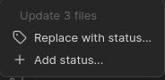

#### Large Vault Performance

If you have a large vault with thousands of notes, use these features for better performance:

1. Enable "Exclude unassigned notes from status pane" in settings
2. Use the search function to filter notes 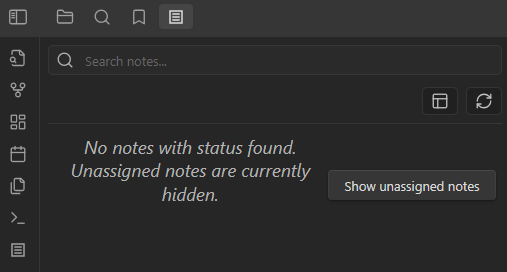
3. Use pagination controls to navigate through large status groups 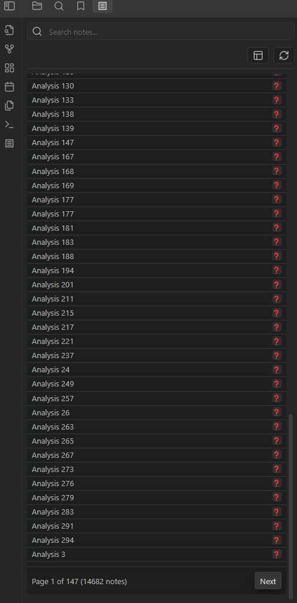

## Configuration

### Status Management

Access plugin settings via Settings → Note Status

#### Status Templates

Choose from predefined status templates:

- **Colorful workflow**: A colorful set of workflow statuses with descriptive icons
- **Minimal workflow**: A simplified set of essential workflow statuses
- **Academic research**: Status workflow for academic research and writing
- **Project management**: Status workflow for project management and tracking

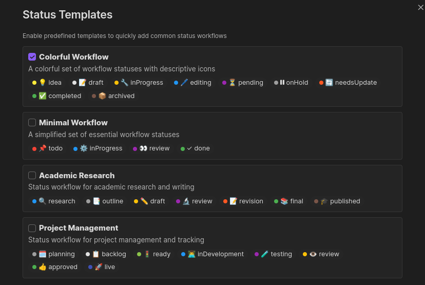

#### Custom Statuses

Create your own statuses by:

1. Clicking "Add Status" in settings
2. Setting a name, icon, color, and optional description
3. Saving your settings

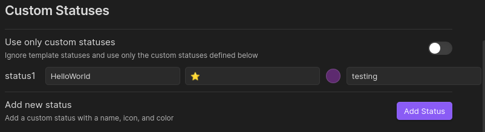

### Display Options

Configure how statuses are displayed:

- Show/hide status bar
- Auto-hide status bar when status is unknown
- Show/hide status icons in file explorer
- Hide unknown status in file explorer
- **Exclude unassigned notes from status pane** (recommended for large vaults)
- Toggle compact view in status pane
- Enable/disable multiple statuses mode
- Customize frontmatter tag name

## Performance Recommendations

If you have a large vault (1000+ notes), consider these settings for optimal performance:

1. Enable "Exclude unassigned notes from status pane"
2. Enable "Hide unknown status in file explorer"
3. Use specific searches rather than browsing all notes
4. Consider using "Compact view" in the status pane

## Commands

The plugin provides several commands accessible via the Command Palette:

- `Open status pane` - Opens the status view
- `Refresh status` - Refreshes current note's status
- `Add status to current note` - Shows status menu
- `Insert status metadata` - Adds status frontmatter
- `Force refresh user interface` - Complete UI refresh

## Technical Details

### Frontmatter Format

Status information is stored in your note's frontmatter using the following format:

```yaml
---
obsidian-note-status: ["active"]
---
```

Multiple statuses:

```yaml
---
obsidian-note-status: ["active", "inProgress"]
---
```

The frontmatter tag name can be customized in settings.

## Development

### Project Structure

The plugin has been recently restructured with a modern, modular architecture:

```
note-status/
├── src/
│   ├── main.ts                          # Main plugin entry point
│   ├── constants/                       # Constants and defaults
│   │   ├── icons.ts                     # SVG icon definitions
│   │   ├── defaults.ts                  # Default settings and colors
│   │   └── status-templates.ts          # Predefined status templates
│   ├── models/                          # TypeScript interfaces and types
│   │   └── types.ts                     # Core type definitions
│   ├── ui/                              # UI components
│   │   ├── components/                  # Core UI components
│   │   │   ├── status-pane-view.ts      # Status pane sidebar
│   │   │   ├── status-dropdown.ts       # Dropdown management
│   │   │   ├── status-dropdown-component.ts # Dropdown UI component
│   │   │   └── status-bar.ts            # Status bar component
│   │   ├── integrations/                # External integrations
│   │   │   └── explorer-integration.ts  # File explorer integration
│   │   └── menus/                       # Menu handlers
│   │       └── status-context-menu.ts   # Context menu handlers
│   ├── services/                        # Core services
│   │   ├── status-service.ts            # Status management logic
│   │   └── style-service.ts             # Dynamic styling service
│   ├── utils/                           # Utility functions
│   │   └── file-utils.ts                # File-related helpers
│   └── settings/                        # Settings UI
│       └── settings-tab.ts              # Settings tab definition
├── styles/                              # Modular CSS files
│   ├── base.css                         # Variables and base styles
│   ├── utils.css                        # Utility classes
│   ├── components/                      # Component-specific styles
│   │   ├── status-bar.css               # Status bar styles
│   │   ├── status-pane.css              # Status pane styles
│   │   ├── dropdown.css                 # Dropdown component styles
│   │   ├── explorer.css                 # File explorer styles
│   │   └── settings.css                 # Settings UI styles
│   └── index.css                        # Main CSS import file
└── styles.css                           # Auto-generated final CSS
```

### Prerequisites

- Node.js and npm installed.
- Obsidian API knowledge (TypeScript-based).

### CSS Modularization

The plugin's CSS has been modularized to improve maintainability:

- **Component-based**: Each UI component has its own CSS file
- **Auto-bundling**: The build process automatically bundles all CSS files into `styles.css`
- **Development workflow**: CSS changes are hot-reloaded during development

When making CSS changes:

1. Modify the appropriate file in the `styles/` directory
2. For new components, create a dedicated CSS file and import it in `styles/index.css`
3. The build process will automatically bundle everything into `styles.css`

### Building the Plugin

1. Clone this repository:

```bash
git clone https://github.com/devonthesofa/obsidian-note-status.git
cd obsidian-note-status
```

2. Install dependencies:

```bash
npm install
```

3. Build the plugin:

```bash
npm run build
```

4. For development with auto-rebuilding:

```bash
npm run dev
```

5. The compiled plugin will be in the root directory, ready to copy into `.obsidian/plugins/`.

## Contributing

Contributions welcome! Please feel free to submit a Pull Request.

1. Fork the repository
2. Create your feature branch: `git checkout -b feature/my-new-feature`
3. Commit your changes: `git commit -am 'Add some feature'`
4. Push to the branch: `git push origin feature/my-new-feature`
5. Submit a pull request

- Report issues or suggest features via the Issues tab.

## Roadmap

The following features and improvements are planned for upcoming releases:

### Short-term

- **Batch Modification Enhancement**: Implement a modal dialog with file preview and status selection for more intuitive batch operations
- **Dropdown Refinement**: Restructure status options to be grouped by categories (workflow, templates, custom) with visual separators
- **Obsidian API Compliance**: Refactor code to follow Obsidian guidelines for better performance and compatibility:
    - Use proper event lifecycle management
    - Implement debounced operations for file operations
    - Improve plugin teardown process to prevent memory leaks

### Medium-term

- **Export/import configurations**: Share your status setups with others

### Long-term

- **Canvas integration**: Show status on canvas cards
- **Graph view integration**: Visualize notes by status in graph view
- **Mobile optimization**: Improved experience on mobile devices

## Support the Development

If you find this plugin useful and would like to support its development, you can make a donation through my PayPal account. Any contribution is greatly appreciated and helps me continue improving the plugin!

PayPal: https://paypal.me/aleixsoler
