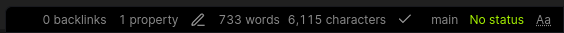
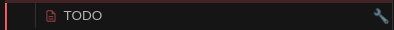
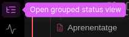
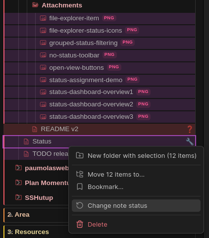

# Note Status for Obsidian

[](https://github.com/devonthesofa/obsidian-note-status/releases)
[](https://github.com/devonthesofa/obsidian-note-status/actions)
[](https://obsidian.md/plugins?id=note-status)
[](https://github.com/devonthesofa/obsidian-note-status/blob/master/LICENSE)
[](https://github.com/devonthesofa/obsidian-note-status/stargazers)

Track the status of your notes with a powerful, customizable status management system. Mark notes as active, completed, on hold, or create your own custom workflows.


_Alt: Demonstration of assigning status to a note using the toolbar dropdown_

## 🎯 Features

- **📋 Status Assignment** - Mark notes with workflow statuses (active, completed, on hold, etc.)
- **🎯 Multi-Status Support** - Assign multiple statuses per note
- **📁 File Explorer Icons** - Visual indicators next to filenames with configurable positioning
- **🧭 Status Bar Integration** - View current status at bottom of editor
- **⬇️ Toolbar Dropdown** - Change statuses quickly from editor toolbar
- **📊 Status Dashboard** - Vault overview with statistics and quick actions
- **📈 Grouped View** - Browse notes organized by status with search and filtering
- **⚡ Batch Operations** - Update multiple files simultaneously
- **🎨 Custom Statuses** - Create your own statuses with icons, colors, and descriptions
- **🏷️ Template Scoping** - Organize statuses by note templates
- **🚀 Performance Optimized** - Works with large vaults (40k+ notes tested)


_Alt: File explorer showing multiple notes with different status icons positioned next to note names and the tooltip with status overview_


_Alt: Status dashboard showing current note information, vault statistics with total notes and coverage percentages_


_Alt: Status distribution chart showing different statuses with colored bars and note counts for each status type_


_Alt: Quick actions panel with organized sections for views, current note operations, clipboard actions, and tools_

## 💻 Technology Stack

Built with modern web technologies for performance and reliability:

- **TypeScript** - Type-safe development
- **React** - Modern UI framework
- **esbuild** - Fast bundling and development
- **Obsidian API** - Deep vault integration

## 📦 Installation

### Community Plugin Store (Recommended)

1. Open Obsidian → Settings → Community plugins
2. Disable Safe mode → Browse → Search "Note Status"
3. Install and Enable

### Manual Installation

1. Download latest release from [GitHub Releases](https://github.com/devonthesofa/obsidian-note-status/releases)
2. Extract `main.js`, `manifest.json`, and `styles.css` to `.obsidian/plugins/note-status/`
3. Enable in Community plugins settings

## 🚀 How to Use

### Quick Start

1. **Assign Status**:

    1. Click the "No status" in toolbar

        

        _Alt: Editor toolbar showing "No status" button for status assignment_

    2. → Select a status

2. **View in Explorer**: Status icons appear next to note names

    

    _Alt: Single file explorer item showing a note with status icon positioned next to the filename_

3. **Browse by Status or open the Dashboard**: Open from left sidebar

    

    _Alt: Left sidebar showing ribbon buttons for opening grouped status view and status dashboard_

4. **Batch Update**: Select multiple files → Right-click → Change status

    

    _Alt: Context menu appearing when right-clicking multiple selected files, showing "Change note status" option_

### Example Workflows

**Personal Knowledge Management**

```
💡 idea → 📝 draft → ✏️ editing → ✅ completed → 📦 archived
```

**Project Management**

```
📋 backlog → 🚦 ready → 👨‍💻 inDevelopment → 🧪 testing → 🚀 live
```

**Academic Research**

```
🔍 research → 📑 outline → ✏️ draft → 🔬 review → 📚 final
```


_Alt: Grouped status view showing notes organized by status with template filtering and search functionality_

### Custom Statuses

Create your own workflow:

1. **Settings** → Note Status → Custom Statuses
2. **Add Status** → Configure name, icon, color, description
3. **Reorder** using arrow controls
4. **Use** in your notes

Example custom status:

```
Name: urgent
Icon: 🔥
Color: #FF0000
Description: Requires immediate attention
```


_Alt: Status selection modal showing custom and template statuses with icons, names, and selection interface_

## 📋 Data Format

Statuses are stored in YAML frontmatter:

```yaml
---
obsidian-note-status:
    - active
    - inProgress
---
```

Works with:

- **Dataview queries**
- **Templater scripts**
- **QuickAdd macros**
- **Global search**

## 🛠️ API Reference

For developers building integrations or contributing:

📚 **[Developer Documentation](https://github.com/devonthesofa/obsidian-note-status/wiki)**

Includes:

- Architecture overview
- Development setup
- API reference
- Contributing guide

## 🤝 Contributing

We welcome contributions!

1. **Check** [GitHub Issues](https://github.com/devonthesofa/obsidian-note-status/issues) for bugs/features
2. **Fork** the repository
3. **Follow** [Development Setup](https://github.com/devonthesofa/obsidian-note-status/wiki/🔧-Development-Setup)
4. **Submit** pull request

## 🐛 Support

- **📖 Documentation**: [Complete Wiki](https://github.com/devonthesofa/obsidian-note-status/wiki)
- **🐞 Bug Reports**: [GitHub Issues](https://github.com/devonthesofa/obsidian-note-status/issues)
- **💡 Feature Requests**: [GitHub Discussions](https://github.com/devonthesofa/obsidian-note-status/discussions)

## ❤️ Support Development

If you find this plugin useful:

[](https://paypal.me/aleixsoler)

**PayPal**: https://paypal.me/aleixsoler

---

**License**: MIT | **Author**: [Aleix Soler](https://aleixsoler.com)
