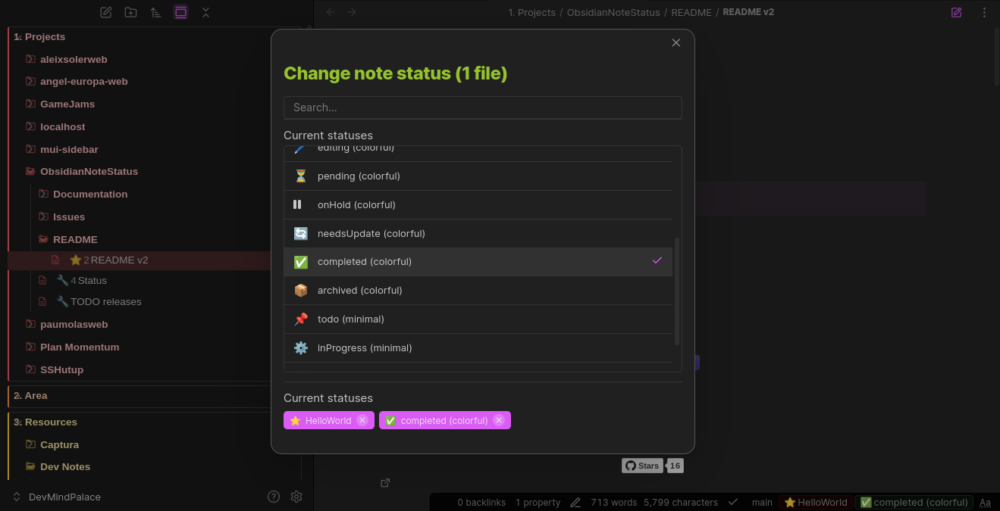
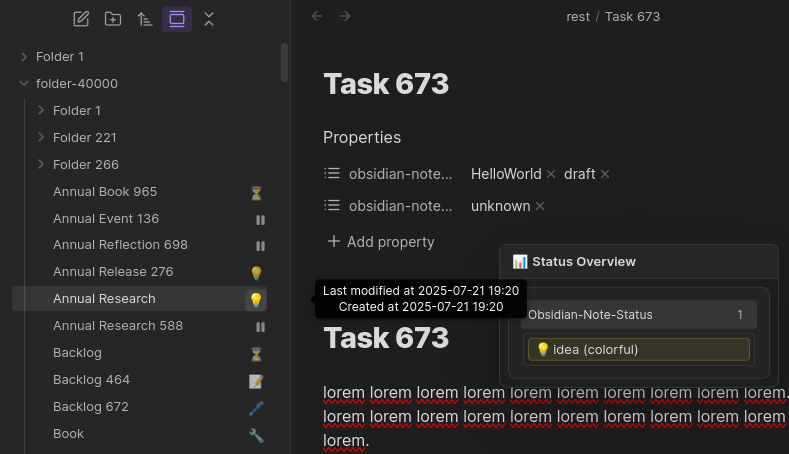
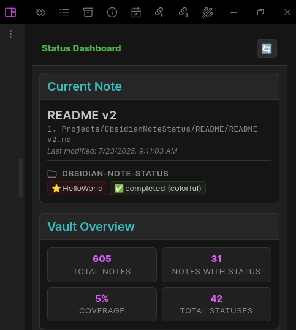
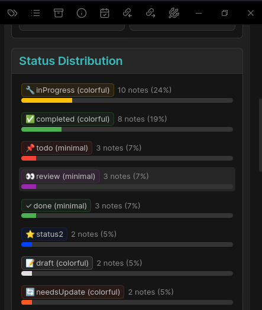
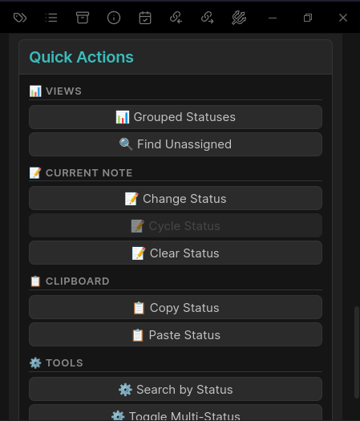
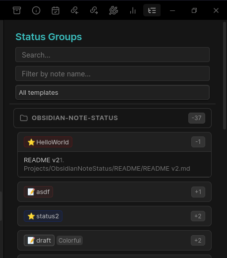
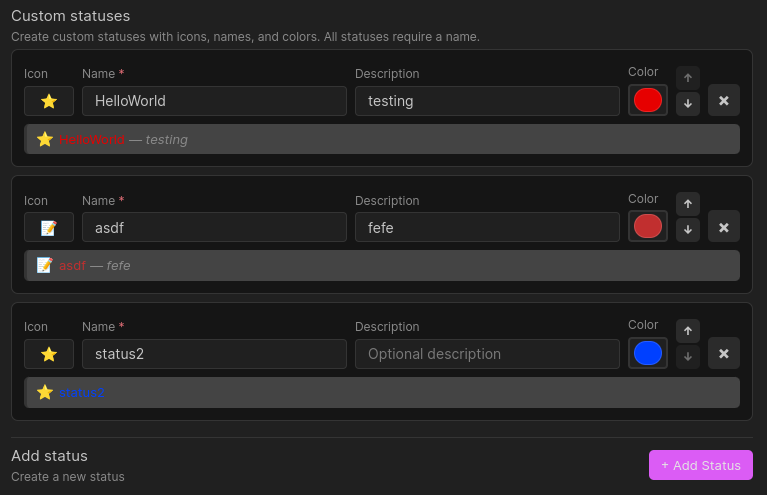

# Note Status for Obsidian

[](https://paypal.me/aleixsoler)
[](https://buymeacoffee.com/aleixsoler)

[](https://github.com/devonthesofa/obsidian-note-status/releases)
[](https://github.com/devonthesofa/obsidian-note-status/actions)
[](https://obsidian.md/plugins?id=note-status)
[](https://github.com/devonthesofa/obsidian-note-status/blob/master/LICENSE)
[](https://github.com/devonthesofa/obsidian-note-status/stargazers)

Track the lifecycle of every file in your vault using statuses you fully control. Note Status brings visual clarity and structured workflows to Obsidian—whether you're managing research notes, writing projects, tasks, or long-term archives.

It works on both Markdown and non-Markdown files, integrates into multiple UI surfaces, and provides configurable dashboards, commands, and fast actions to keep information flowing.

## Contents

- [Feature Guide](docs/features.md): what the plugin can do across commands, UI surfaces, and workflows.
- [Settings Reference](docs/settings.md): every option, grouped like the in-app settings.

## Quick start

1. Open Settings → Note Status.
2. Expand **Templates & Statuses** and keep a built-in template or add your own/custom-only set.
3. Pick where to see/change status: **Status Bar** or **Editor Toolbar**.
4. Set a status from the badge or run `Change current note status`.
5. Watch file explorer icons update; hover for the overview popup or click to change again.
6. If enabled, open the **Status Dashboard** or **Grouped Status View** from the ribbon/commands.

## Key features

- Status picker everywhere: status bar badge, editor toolbar, explorer context menus, commands.
- Multi-status or single-status workflows; quick-status commands for hotkeys.
- File explorer icons with configurable placement, frames, and visual treatments (row tint, underline, dot, border).
- Status bar badges with accent/filled/dot styles and icon/text options; template names can auto-show on conflicts.
- Dashboards and grouped views (gated by experimental toggles and vault size limit) for vault-wide visibility and quick actions.
- Built-in templates (Colorful, Minimal, Academic, Project) plus full custom templates and standalone custom statuses.
- Works with YAML frontmatter and non-Markdown via a synced JSON store; frontmatter mappings let you write to multiple keys.

## Data model

- **Markdown**: statuses live under the tag prefix (default `obsidian-note-status`). Map templates/statuses to extra YAML keys and optionally also write to the default.
- **Non-Markdown**: stored in `.obsidian/plugins/obsidian-note-status/non-markdown-statuses.json`, kept in sync on rename/delete.
- **Single vs multi**: multiple statuses by default; single-status mode can store as list (`status: [draft]`) or string (`status: draft`) for compatibility.

## Screenshots

- Status assignment workflow: 
- File explorer with status icons and hover overview: 
- Status dashboard:   
- Grouped status view: 
- Custom statuses editor: 

## Installation

### Community Plugin Store (recommended)

1. Obsidian → Settings → Community plugins.
2. Disable Safe mode → Browse → search “Note Status”.
3. Install and enable.

### Manual

1. Download the latest release from [GitHub Releases](https://github.com/devonthesofa/obsidian-note-status/releases).
2. Extract `main.js`, `manifest.json`, and `styles.css` to `.obsidian/plugins/note-status/`.
3. Enable in Community plugins settings.

## Example workflows

**Personal knowledge**

```
💡 idea → 📝 draft → ✏️ editing → ✅ completed → 📦 archived
```

**Project delivery**

```
📋 backlog → 🚦 ready → 👨‍💻 inDevelopment → 🧪 testing → 🚀 live
```

**Academic**

```
🔍 research → 📑 outline → ✏️ draft → 🔬 review → 📚 final
```

## Data format

Statuses in YAML:

```yaml
---
obsidian-note-status:
    - active
    - inProgress
---
```

Works with Dataview, Templater, QuickAdd, and search. Non-Markdown uses the JSON store noted above.

## API / contributing / support

- Issues & feature requests: [GitHub Issues](https://github.com/devonthesofa/obsidian-note-status/issues) / [Discussions](https://github.com/devonthesofa/obsidian-note-status/discussions).
- Contributions welcome: fork, follow dev setup in the wiki, open a PR.

## Support the project

[](https://paypal.me/aleixsoler)
[](https://buymeacoffee.com/aleixsoler)

---

**License**: MIT · **Author**: [Aleix Soler](https://aleixsoler.com)
